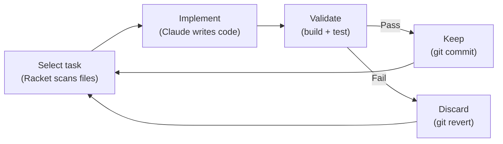

# Ruyi (如意)

**Point Claude Code at your repo and say what you want. Ruyi does the rest — in a loop, safely, until it's done.**

> "Improve test coverage." Ruyi writes 14 tests across 6 files. Keeps the 11 that pass, reverts the 3 that don't. You review one clean diff.



## Quick Start

```bash
brew install minimal-racket                        # one-time
git clone https://github.com/ZhenchongLi/ruyi.git ~/ruyi

cd your-project                                    # any language, any framework
racket ~/ruyi/evolve.rkt init                      # auto-detects everything, asks what you want
racket ~/ruyi/evolve.rkt                           # start evolving
```

## What does `init` look like?

```
$ cd my-react-app
$ racket ~/ruyi/evolve.rkt init

=== Ruyi Init ===

Detected: TypeScript (react), build: pnpm
Path:     /Users/you/my-react-app

What would you like ruyi to do?
Examples:
  - Improve test coverage
  - Fix GitHub issues
  - Refactor large files
  - Translate docs to English
  - Any goal you have in mind

> Improve test coverage

Plan: Write tests for untested source files, prioritizing core logic
Mode: coverage

Created: .ruyi.rkt

Ready! Run:
  racket ~/ruyi/evolve.rkt
```

Zero config files to write. Ruyi detects your language, build tool, and test framework automatically.

## What does a run look like?

```
=== Iteration 1/20 ===
Task: Write tests for src/auth/session.ts
Claude: implementing...
Validate: pnpm test ✓
Result: keep (commit a3f9c21)

=== Iteration 2/20 ===
Task: Write tests for src/api/users.ts
Claude: implementing...
Validate: pnpm test ✗ (1 assertion failed)
Result: discard (reverted)

=== Iteration 3/20 ===
Task: Write tests for src/api/billing.ts
Claude: implementing...
Validate: pnpm test ✓
Result: keep (commit e82b4f0)

...

=== Done: 11 kept, 3 discarded, 6 skipped ===
```

Every iteration either commits or reverts. No half-applied changes. No broken state.

## How it works

The key idea: **separate the deterministic from the creative**.

| | Racket (deterministic) | Claude (creative) |
|---|---|---|
| **Does** | Selects tasks, runs validation, manages git, enforces limits | Reads code, understands intent, writes implementations |
| **Why** | These things must be reliable — code guarantees they are | This is where AI shines — understanding and creating |

Each iteration:
1. Racket scans your project and picks the next task
2. Racket calls Claude with a focused, single-task prompt
3. Claude implements the change
4. Racket runs your build + test commands
5. Pass → `git commit` / Fail → `git checkout .`
6. Log the result, repeat

**Safety**: always works on a branch, auto-reverts on failure, enforces diff size limits, respects forbidden files. You review one PR at the end.

## Modes

| Mode | What it does | Example |
|------|-------------|---------|
| `coverage` | Writes tests for untested files | "Improve test coverage" |
| `filesize` | Splits oversized files into modules | "Break up large files" |
| `issue` | Fixes open GitHub issues one by one | "Fix GitHub issues" |
| `refactor` | Simplifies complex code | "Refactor large files" |
| `evolve-doc` | Improves docs via LLM-as-Judge scoring | "Improve the README" |

## Supported Languages

| Language | Build | Test | Detection |
|----------|-------|------|-----------|
| TypeScript / JavaScript | pnpm, npm, yarn, bun | vitest, jest | `package.json` |
| Python | uv, poetry, pip | pytest, unittest | `pyproject.toml` |
| C# / .NET | dotnet | dotnet test | `*.csproj`, `*.sln` |
| Rust | cargo | cargo test | `Cargo.toml` |
| Go | go | go test | `go.mod` |
| Racket | raco | raco test | `*.rkt` |

## Self-evolution

Ruyi can evolve itself. This README was improved by Ruyi's own Judge mode — iterating against a quality rubric, keeping versions that score above threshold, discarding the rest:

```
2026-03-26  evolve-doc  Score 7.4   discard   (below threshold)
2026-03-26  evolve-doc  fe74537     keep      (score: 8.2)
2026-03-26  evolve-doc  Score 7.4   discard   (below threshold)
2026-03-26  evolve-doc  29a2513     keep      (score: 8.3)
```

## Requirements

- [Racket](https://racket-lang.org/) 9.0+ (`brew install minimal-racket`)
- [Claude Code](https://claude.ai/code) CLI installed and authenticated
- Git

## License

MIT
