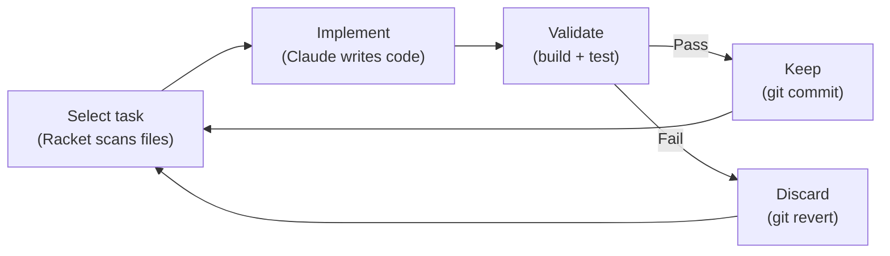

# Ruyi (如意)

> As you wish — a deterministic evolution engine for any codebase.

Ruyi automates codebase improvement through a simple loop: **select task → Claude implements → validate → keep or discard → repeat**. The loop is deterministic Racket code that never forgets to revert, never miscounts iterations, and never skips validation. Claude only does what it's best at: reading and writing code.



## Quick Start

```bash
# Install Racket (one-time)
brew install minimal-racket

# Clone ruyi
git clone https://github.com/ZhenchongLi/ruyi.git ~/ruyi

# Go to ANY project you want to improve
cd your-project

# Initialize — ruyi detects your project and asks what you want
racket ~/ruyi/evolve.rkt init

# Start evolving
racket ~/ruyi/evolve.rkt
```

That's it. Ruyi auto-detects your language, build tool, and test framework. You just tell it what you want.

## What happens during `init`?

```
$ cd my-react-app
$ racket ~/ruyi/evolve.rkt init

=== Ruyi Init ===

Detected: TypeScript (react), build: pnpm
Path:     /Users/you/my-react-app

What would you like ruyi to do?
Examples:
  - Improve test coverage
  - Fix GitHub issues
  - Refactor large files
  - Translate docs to English
  - Any goal you have in mind

> Improve test coverage

Plan: Write tests for untested source files, prioritizing core logic
Mode: coverage

Created: .ruyi.rkt

Ready! Run:
  racket ~/ruyi/evolve.rkt
```

## Supported Languages

| Language | Build | Test | Detection |
|----------|-------|------|-----------|
| TypeScript / JavaScript | pnpm, npm, yarn, bun | vitest, jest | `package.json` |
| Python | uv, poetry, pip | pytest, unittest | `pyproject.toml` |
| C# / .NET | dotnet | dotnet test | `*.csproj`, `*.sln` |
| Rust | cargo | cargo test | `Cargo.toml` |
| Go | go | go test | `go.mod` |
| Racket | raco | raco test | `*.rkt` |

## Modes

| Mode | What it does |
|------|-------------|
| `coverage` | Write tests for untested files |
| `filesize` | Split oversized files |
| `issue` | Fix open GitHub issues |
| `refactor` | Simplify complex code |

## How it works

The key insight: **separate the deterministic from the creative**.

- **Racket** (deterministic): selects tasks, runs validation, manages git, logs results, enforces iteration limits. These things must be reliable — code guarantees they are.
- **Claude** (creative): reads code, understands logic, writes implementations. This is where AI shines — no rigid rules, just understanding and creating.

Each iteration:
1. Racket scans your project and picks the next task
2. Racket calls Claude with a focused, single-task prompt
3. Claude implements the change
4. Racket runs your build + test commands
5. All pass → `git commit` (keep)
6. Any fail → `git checkout .` (discard, move on)
7. Log the result, go to step 1

Safety: always works on a branch, never touches your main code, auto-reverts on failure.

## Requirements

- [Racket](https://racket-lang.org/) 9.0+ (`brew install minimal-racket`)
- [Claude Code](https://claude.ai/code) CLI installed and authenticated
- Git

## License

MIT
