# Ruyi (如意)

[](LICENSE) [](https://racket-lang.org/) [](https://claude.ai/code)

**Claude broke main again? Not with Ruyi.** Every AI change either commits clean or reverts completely — you review one PR, not a half-applied disaster.

The control loop is deterministic Racket, not an LLM — safety guarantees are code, not prompts. ~2,000 lines you can [read yourself](engine.rkt).

```
         ┌──────────┐
         │ Pick task │
         └────┬─────┘
              ▼
     ┌─────────────────┐
     │ Claude writes    │
     │ code / tests     │
     └────────┬────────┘
              ▼
       ┌────────────┐
       │ Run tests   │
       └──┬──────┬──┘
          │      │
     Pass ▼      ▼ Fail
   ┌──────────┐ ┌──────────┐
   │git commit│ │git revert│
   └──────────┘ └──────────┘
          │      │
          └──┬───┘
             ▼
        Next iteration
```

> "Improve test coverage." Ruyi writes 14 tests across 6 files. Keeps the 11 that pass, reverts the 3 that don't. You review one clean diff.
>
> "Fix GitHub issues." Ruyi picks up open issues one by one, implements a fix, runs your test suite. Passing fix gets committed with the issue linked. Failing fix gets reverted. You wake up to closed issues and a single PR.

## Quick Start

**Option A — clone and alias** (3 commands, nothing hidden):

```bash
brew install minimal-racket
git clone https://github.com/ZhenchongLi/ruyi.git ~/ruyi
echo 'alias ruyi="racket ~/ruyi/evolve.rkt"' >> ~/.zshrc && source ~/.zshrc
```

**Option B — install script** ([read it first](https://github.com/ZhenchongLi/ruyi/blob/main/install.sh) — it just does the three steps above):

```bash
/bin/bash -c "$(curl -fsSL https://raw.githubusercontent.com/ZhenchongLi/ruyi/main/install.sh)"
```

Then:

```bash
cd your-project          # any language, any framework
ruyi init                # auto-detects everything, asks what you want
ruyi                     # start evolving
```

## Modes

Describe your goal in plain English during `ruyi init` — Ruyi selects the right mode automatically.

| Mode | You say | What happens |
|------|---------|-------------|
| `coverage` | "Improve test coverage" | Writes tests file-by-file, commits each passing test suite |
| `issue` | "Fix GitHub issues" | Picks up open issues, implements + tests a fix per iteration |
| `freestyle` | "Translate docs to Spanish" | Any goal — validated by your test suite each iteration |
| `evolve-doc` | "Improve the README" | Iterates docs via LLM-as-Judge scoring (this README was written this way) |
| `refactor` | "Refactor large files" | Simplifies one file at a time, build must pass |
| `filesize` | "Break up large files" | Splits oversized files into modules + updates imports |

## How it works

Each iteration is atomic — **pass tests? `git commit`. Fail? `git revert`.** No broken intermediate state, ever.

This is what separates Ruyi from "just run Claude in a loop":
- **Atomic commit-or-revert** — every iteration either passes and commits, or reverts completely
- Always works on a branch — never touches main
- Enforces diff size limits (default 500 lines) — no runaway changes
- Respects forbidden files — won't touch what you protect
- You review one clean PR at the end

## What a run looks like

A real `coverage` run on a TypeScript project. Each iteration is independent — a failure in iteration 2 doesn't affect the code committed in iteration 1:

<p align="center">
  
</p>

<details>
<summary>Can't see the animation? Here's the terminal output:</summary>

```
 ╭─────────────────────────────────────────────────╮
 │  Ruyi — coverage session                        │
 │  Project: my-app (TypeScript, pnpm)             │
 │  Branch:  ruyi/coverage-session                 │
 ╰─────────────────────────────────────────────────╯

 Iteration 1 ─────────────────────────────────────
   Target: src/auth/session.ts (0% coverage)
   Claude: writing tests...
   Run:    pnpm test -- session.test.ts
   Result: ✅ 14 tests pass
   Commit: a3f9c21 test(session): add 14 tests

 Iteration 2 ─────────────────────────────────────
   Target: src/api/billing.ts (12% coverage)
   Claude: writing tests...
   Run:    pnpm test -- billing.test.ts
   Result: ❌ 3 tests fail (mock DB mismatch)
   Revert: changes discarded, branch unchanged

 Iteration 3 ─────────────────────────────────────
   Target: src/api/billing.ts (12% coverage)
   Claude: writing tests (fresh attempt)...
   Run:    pnpm test -- billing.test.ts
   Result: ✅ 8 tests pass
   Commit: e82b4f0 test(billing): add 8 tests

 ── Session complete: 2 committed, 1 reverted ──
```

</details>

**Your git log at the end** — only passing iterations survive:

```
$ git log --oneline ruyi/coverage-session

e82b4f0 test(billing): add 8 tests for src/api/billing.ts
a3f9c21 test(session): add 14 tests for src/auth/session.ts
  ↑ failed attempts leave no trace
```

## Verified on real projects

Every claim is verifiable — click the commits:

- **This README** — written and iterated by Ruyi's `evolve-doc` mode. [27 iterations](evolution-log.tsv): 13 kept, 14 discarded. Every kept commit is a real diff you can inspect on GitHub:
  - [`5044d5d`](https://github.com/ZhenchongLi/ruyi/commit/5044d5d) — first kept draft (score: 7.6)
  - [`eff19ab`](https://github.com/ZhenchongLi/ruyi/commit/eff19ab) — biggest single jump (score: 8.7)
  - [`f50d827`](https://github.com/ZhenchongLi/ruyi/commit/f50d827) — latest iteration (score: 8.6)
- **Ruyi's own engine** — `coverage` mode writing tests for the core Racket modules ([iteration log](evolution-log.tsv))
- **Try it yourself** — clone any public repo with tests, run `ruyi init`, and watch. Start with a small repo to see the commit-or-revert cycle in under a minute.

| Metric | Value |
|--------|-------|
| Total iterations logged | 27 |
| Kept / Discarded | 13 / 14 |
| Score range (README) | 7.6 → 8.7 |
| Broken main branches | 0 |

Most AI output isn't good enough to ship. Ruyi's atomic loop means bad output is automatically discarded — only what passes your tests survives.

## What does `init` look like?

```
$ cd my-react-app
$ ruyi init

=== Ruyi Init ===

Detected: TypeScript (react), build: pnpm
Path:     /Users/you/my-react-app

What would you like ruyi to do?
Examples:
  - Improve test coverage
  - Fix GitHub issues
  - Refactor large files
  - Translate docs to English
  - Any goal you have in mind

> Improve test coverage

Plan: Write tests for untested source files, prioritizing core logic
Mode: coverage

Created: .ruyi.rkt

Ready! Run:
  ruyi
```

Zero config files to write. Ruyi detects your language, build tool, and test framework automatically. Works with TypeScript, Python, C#/.NET, Rust, Go, and Racket — if it has a `package.json`, `pyproject.toml`, `Cargo.toml`, or equivalent, Ruyi picks it up.

<details>
<summary>Why Racket?</summary>

The safety invariants (atomic commit-or-revert, diff size limits, forbidden file enforcement) are too important to leave to an LLM. The entire engine is ~2,000 lines of Racket — you can read the core loop ([`engine.rkt`](engine.rkt) + [`evolve.rkt`](evolve.rkt) + [`git.rkt`](git.rkt)) in about 10 minutes. The install script adds a `ruyi` alias — you never need to type `racket` directly.

</details>

## Requirements

- [Claude Code](https://claude.ai/code) CLI installed and authenticated
- Git
- [Racket](https://racket-lang.org/) 9.0+ (installed automatically by `install.sh`, or `brew install minimal-racket`)

## License

MIT
